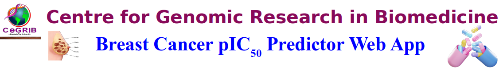

#             Breast Cancer pIC50 Prediction Web App


## Overview
A Streamlit web application that predicts pIC50 values for compounds targeting breast cancer proteins using machine learning models trained on ChEMBL bioactivity data.

### Live Demo
[](https://breast-cancer-pic50.streamlit.app/)

### Features

- 🎯 Target-specific predictions for 20+ breast cancer proteins
- 🧪 Models trained on experimental data from ChEMBL database
- 🖥️ Simple CSV input with SMILES strings
- 📊 Instant predictions with downloadable results
- 🚀 Powered by CatBoost and RDKit
  
```markdown
## Installation

```bash
git clone https://github.com/CeGRIB/breast_cancer.git
cd breast_cancer
conda  create -n "breastcancer python=3.12  #create a python 3.12 environment
conda activate breastcancer  #activate your environment
pip install -r requirements.txt
```

## Usage

1. Run the app:
```bash
streamlit run app.py
```

2. In the app:
- Select target protein
- Upload CSV with SMILES strings
- View/download predictions

### Input Format
```csv
name,SMILES
Compound1,CN1C=NC2=C1C(=O)N(C(=O)N2C)C
Compound2,CC(=O)OC1=CC=CC=C1C(=O)O
```

[Sample Input File](https://example.com/sample.csv)

## Model Performance

| Target  | R²    | RMSE |
|---------|-------|------|
| ER      | 0.87  | 0.45 |
| HER2    | 0.85  | 0.48 |
| AKT     | 0.82  | 0.51 |

## File Structure

```
├── app.py                # Main application
├── requirements.txt      # Dependencies
├── models/               # Pretrained models
├── notebooks/            # Training notebooks
└── images/               # App visuals
```

## Contributing

1. Fork the repository
2. Create your feature branch
3. Commit your changes
4. Push to the branch
5. Open a pull request

## License

MIT License

## Contact

CeGRIB - [@cegrib](https://github.com/cegrib)
